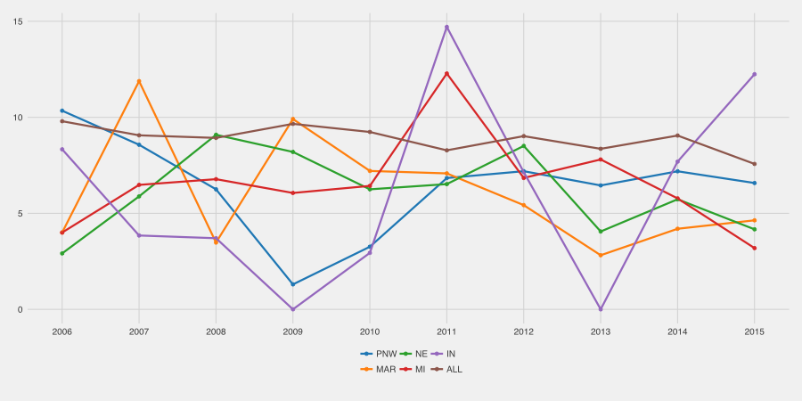

# FRC Attrition Data

I created this at the reqest of Michael Corsetto to look into the impact that the district system has on team sustainability. Included is a list of teams in each year ([1992–2016]) in the file `teams.csv` It was created based off the Mark McLeod's data set. 

## Output

#### Reading
This is a plot of the retention percentages for each year ([2005–2016]). Higher is better. 

## Running
There's an included R script included (`attrition.r`) that will generate a plot of team attritions in various regions. 

### Limitations
- Easily scoping down for MAR teams is very difficult. As such, instead of being 100% correct in MAR I set it up to include all Pennsylvania teams
- Team Merges - 47/65 merging into 51 is included as attrition. It's a small enough percentage of instances that rather than trying (and failing) to remove all instances of this, I just left it in.
- Temporary Drops - Events like the Canadian Teacher Strike caused teams to drop out a year, honestly, it's too much work to track and special case all of that. Again, likely, within noise.

